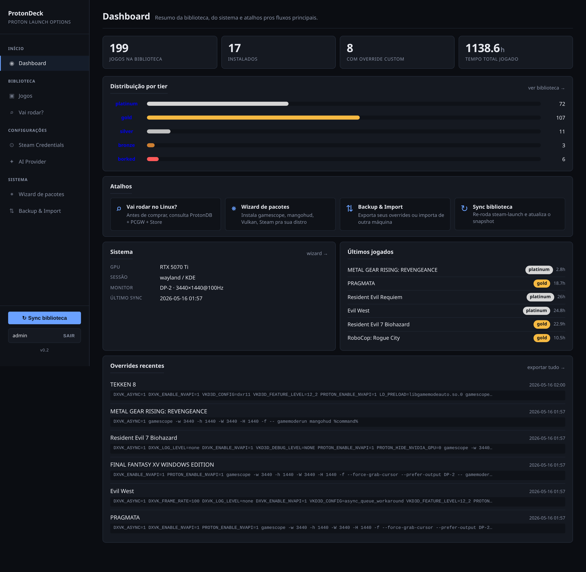
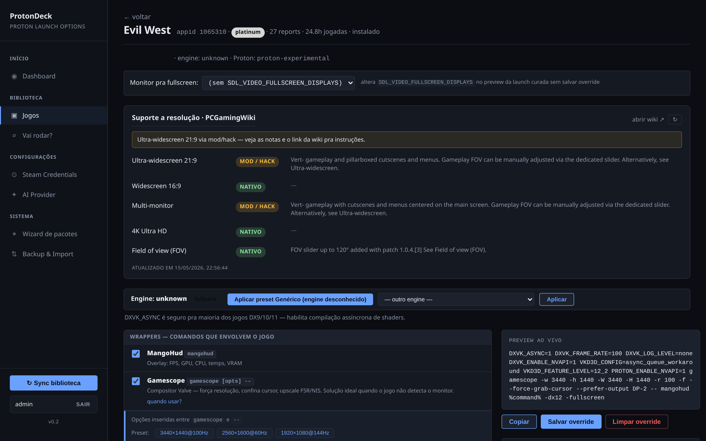
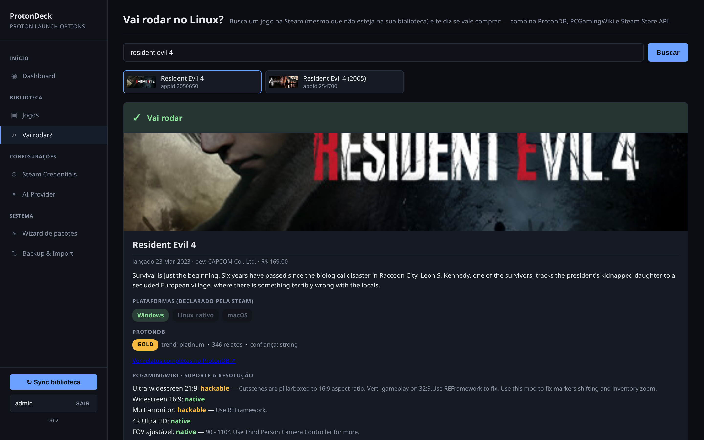
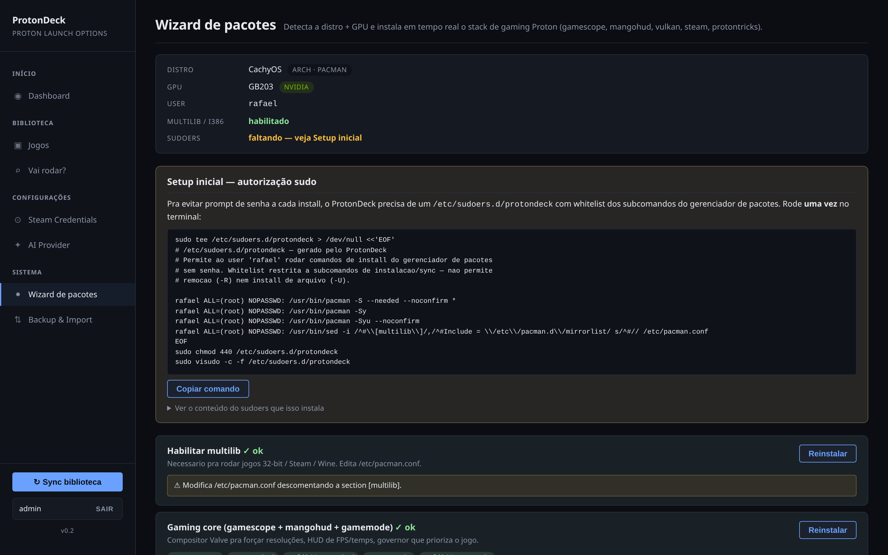
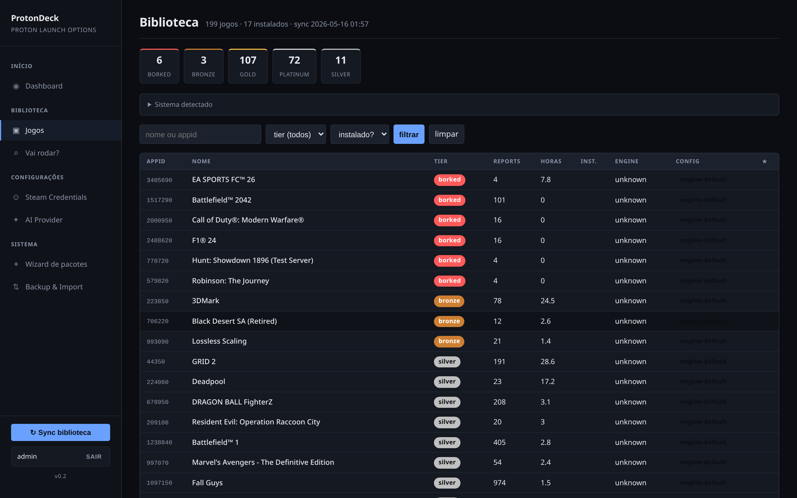
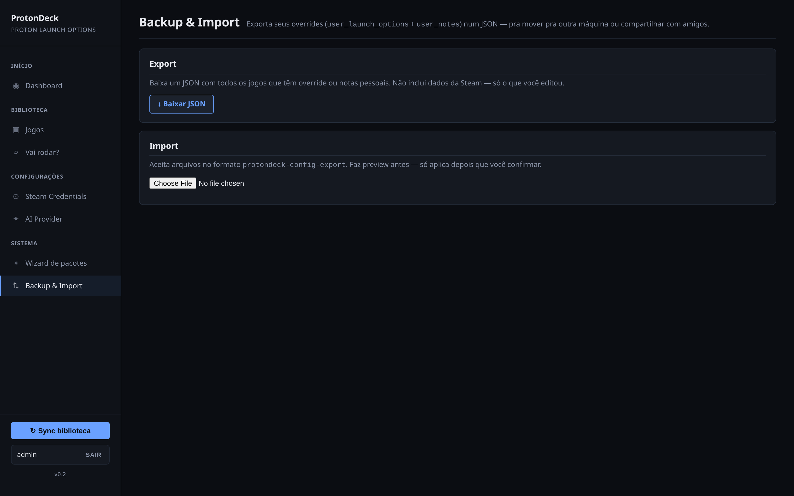
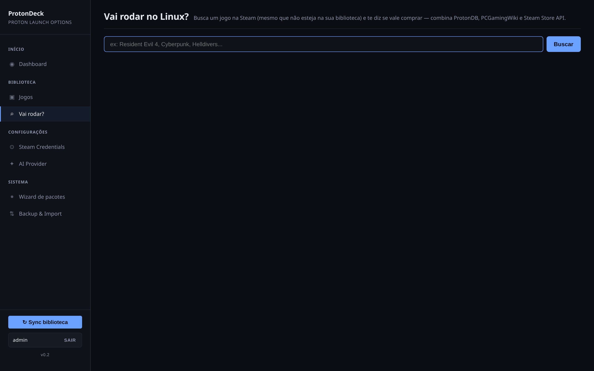
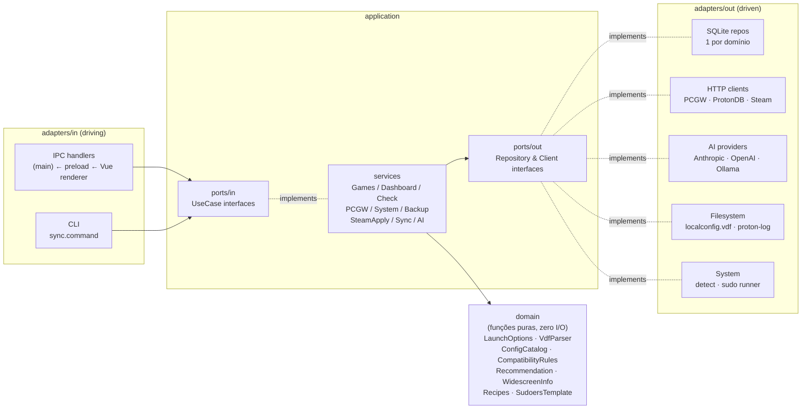
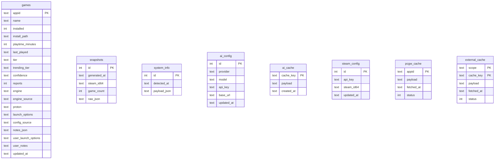

# ProtonDeck

App desktop (Electron) de curadoria Proton pra Linux gamers. Combina Steam
Web API, ProtonDB, PCGamingWiki e detecção de hardware local
pra te ajudar a configurar jogos com Proton, verificar compatibilidade antes
de comprar, e instalar o stack de gaming na sua distro.

Stack: Electron + Vue 3 (renderer) + TypeScript + better-sqlite3. O renderer
Vue fala com o processo `main` por **IPC** (sem servidor HTTP, sem porta, sem
cookies) através de um preload com `contextIsolation`; o main expõe os mesmos
application services e roda todo o backend local (SQLite, IA, filesystem do
Steam, sudo), sem rede. Build/empacotamento via electron-vite + electron-builder.
Arquitetura hexagonal — domain puro / ports / use cases / adapters separados.

## Screenshots

| Dashboard                                | Builder de launch options (Evil West)  |
|------------------------------------------|----------------------------------------|
|  |  |

| "Vai rodar?" — Resident Evil 4           | Wizard de pacotes                      |
|------------------------------------------|----------------------------------------|
|  |  |

| Biblioteca                               | Backup &amp; Import                    |
|------------------------------------------|----------------------------------------|
|   |  |

| "Vai rodar?" (busca vazia)               |
|------------------------------------------|
|  |

> Os screenshots são da versão anterior da UI; o visual (CSS) foi mantido na
> migração pra Vue. Recapture da janela do app rodando (`npm run dev`).

## O que tem

| Area                          | URL          | O que faz                                                                                     |
|-------------------------------|--------------|-----------------------------------------------------------------------------------------------|
| **Dashboard**                 | `/`          | stats da biblioteca, distribuição por tier ProtonDB, atalhos pros principais fluxos. |
| **Biblioteca**                | `/games`     | tabela filtravel da Steam library: tier, engine detectada, Proton version, override pessoal. |
| **Editor de launch options**  | `/game/:appid` | builder visual com checkboxes pra gamescope, env vars (DXVK/VKD3D/Proton/NVIDIA), args, presets por engine, preview ao vivo, diagnostico de conflitos, assistente IA. |
| **PCGamingWiki widescreen**   | (dentro do `/game/:appid`) | suporte a widescreen 16:9 / ultra-widescreen 21:9 / multi-monitor / 4K / FOV, com notas extraidas da wiki. |
| **"Vai rodar?"**              | `/check`     | busca jogo na Steam por nome (mesmo que nao esteja na biblioteca) e cruza ProtonDB + PCGW + Steam Store; retorna recomendacao em 5 niveis (go / caution / risky / unreleased / no-data). [diagrama de fluxo abaixo](#fluxo-vai-rodar-check) |
| **Wizard de pacotes**         | `/system`    | detecta distro (Arch/CachyOS, Ubuntu/Debian, Fedora) + GPU e instala em tempo real (log streaming via IPC) o stack Proton (gamescope, mangohud, gamemode, Vulkan, Steam, protontricks). |
| **Backup &amp; Import**       | `/backup`    | exporta seus overrides em JSON (diálogo nativo de salvar); importa com preview antes de aplicar. |
| **Aplicar direto no Steam**   | botao em `/game/:appid` | edita `~/.steam/steam/userdata/&lt;id&gt;/config/localconfig.vdf` com backup automatico e barreira se o cliente Steam estiver rodando. |

## Arquitetura

Hexagonal clássica (ports &amp; adapters de Cockburn) com camadas
**domain / application / adapters**.



```
src/
  domain/                          entidades + funcoes puras (zero I/O)
    games/                         LaunchOptions, ConfigCatalog, CompatibilityRules, VdfParser
    check/                         CheckResult, ProtonReport, Recommendation
    pcgw/                          WidescreenInfo
    system/                        Recipes, SudoersTemplate, SystemTypes

  application/                     a "hexagon" — orquestra o dominio
    ports/
      in/                          inbound (primary/driving) ports — interfaces
                                   dos use cases que o mundo externo chama:
                                   GamesUseCase, DashboardUseCase, CheckUseCase,
                                   PCGWUseCase, SystemUseCase, BackupUseCase,
                                   SteamApplyUseCase, SyncUseCase, AIUseCase
      out/                         outbound (secondary/driven) ports —
                                   interfaces que a application REQUER:
                                   GameRepository, AIConfigRepository,
                                   SteamConfigRepository, CacheRepository,
                                   SnapshotRepository, SystemInfoRepository,
                                   PCGWClient, CheckClients,
                                   ProtonDBCommunityClient,
                                   SteamLocalConfigClient, ProtonLogReader,
                                   SystemDetector, SystemRunner
    services/                      implementacoes dos inbound ports
                                   (GamesService implements GamesUseCase, etc)

  adapters/
    in/                            inbound adapters — driving
                                   (chamam os ports/in/)
      ipc/                         handlers.ts — registra os canais ipcMain
                                   que chamam os services (espelha o antigo http)
      cli/                         sync.command.ts
    out/                           outbound adapters — driven
                                   (implementam os ports/out/)
      persistence/sqlite/          connection.ts + 1 repo por dominio
      http-clients/                PCGWMediaWiki, ProtonDB (summary + community),
                                   SteamSearch, SteamStore
      ai/                          AIProvider (Anthropic/OpenAI/Ollama) + Prompts + Tools
      fs/                          SteamLocalConfigFs, ProtonLogFs
      system/                      LinuxSystemDetector, SudoSystemRunner
      shared/                      fetch helper

  main/                            processo main do Electron (index.ts) —
                                   app lifecycle + BrowserWindow + registerIpc
  preload/                         contextBridge → window.api (ponte IPC)
  renderer/                        SPA Vue 3 (views/, components/, router, api.js)
                                   + assets/style.css (mesmo CSS de antes)

  composition.ts                   monta o grafo de deps (composition root)
```

Regras de dependência:

- **`domain/`** não importa de ninguém.
- **`application/`** importa só de `domain/` e dos próprios
  `application/ports/`.
- **`adapters/in/`** chama `application/ports/in/` (use cases).
- **`adapters/out/`** implementa `application/ports/out/`.
- **`composition.ts`** é o único arquivo que instancia adapters
  concretos e injeta no grafo.

Trocar SQLite por Postgres mexe só em `adapters/out/persistence/`.
Trocar Anthropic por Bedrock mexe só em `adapters/out/ai/`. Adicionar
uma CLI nova mexe só em `adapters/in/cli/`.

## Rodar (desenvolvimento)

```bash
git clone ssh://git@gitea.homelab-cloud.com:2222/admin/protondeck.git
cd protondeck
npm install     # postinstall recompila better-sqlite3 pra ABI do Electron

# Abre o app com HMR (electron-vite: main + preload + renderer Vue)
npm run dev
```

`npm run dev` usa **electron-vite**: builda o processo `main` e o `preload`,
sobe o dev-server Vite do renderer (com HMR) e abre a janela Electron apontando
pra ele. Sem `.env` — o app é single-user local e não tem login.

**Módulos nativos (ABI):** `better-sqlite3` é binário nativo. O `postinstall`
roda `electron-builder install-app-deps`, que o recompila pra ABI do Electron —
então depois de `npm install` o app (`npm run dev`/`dist`) funciona direto. Como
os testes rodam sob Node (ABI diferente), pra rodar `npm test` localmente
recompile de volta pra Node primeiro:

```bash
npm run rebuild:node   # npm rebuild better-sqlite3 (ABI do Node)
```

Onde ficam os dados (via `app.getPath('userData')`, normalmente
`~/.config/ProtonDeck/`):

- `panel.db` — SQLite (jogos, snapshots, config IA);
- `community-cache/` — cache dos relatos ProtonDB.

Requisitos:

- Node.js ≥ 20.12 (pro toolchain de dev/build)
- Skill `steam-launch` instalada em `~/.claude/tools/steam-launch/` (ou path em `STEAM_LAUNCH_TOOL`)
- `credentials.json` em `~/.claude/tools/steam-launch/data/` com `steam_api_key` + `steam_id64`

Pra popular a biblioteca a partir do Steam (usa o skill `steam-launch`) pela
linha de comando, ou clique em **Sync biblioteca** na sidebar do app:

```bash
npm run sync   # grava em data/panel.db (CLI dev); no app, o sync roda pela UI
```

### Wizard de pacotes — sudoers (uma vez)

Pra evitar prompt de senha a cada install, o painel precisa de um
`/etc/sudoers.d/protondeck` com whitelist restrita (só subcomandos de
install/sync — não permite `-R` nem `-U`). Abra `/system` na UI que
ele gera o comando exato pra sua distro/usuario; rode no terminal:

```bash
sudo tee /etc/sudoers.d/protondeck > /dev/null <<'EOF'
USER ALL=(root) NOPASSWD: /usr/bin/pacman -S --needed --noconfirm *
# ... resto gerado dinamicamente pela tela
EOF
sudo chmod 440 /etc/sudoers.d/protondeck
sudo visudo -c -f /etc/sudoers.d/protondeck
```

### Aplicar direto no Steam — requer cliente fechado

A ação **Aplicar no Steam** (canal IPC `games:applySteam`) edita o
`localconfig.vdf` e faz backup `.protondeck.bak`. **Se o Steam estiver rodando**, o cliente
sobrescreve o arquivo ao fechar — o painel detecta isso via `pgrep -x steam`
e bloqueia o write com mensagem clara.

## Empacotar (instaladores desktop)

O empacotamento usa [electron-builder](https://www.electron.build/). Por ser
app desktop com acesso ao host (wizard de pacotes, sync, apply Steam, proton
log), todas as features funcionam — diferente de um container, que isolaria
`sudo`/`~/.steam`/`/etc/os-release`.

```bash
npm run build       # electron-vite build → out/{main,preload,renderer}
npm run dist:linux  # gera release/ com AppImage + .deb
npm run dist:dir    # build não-empacotado em release/linux-unpacked (debug rápido)
```

Targets configurados no bloco `build` do `package.json`:

| Comando            | Saída                                  |
|--------------------|----------------------------------------|
| `npm run dist:linux` | `release/ProtonDeck-<ver>.AppImage` + `release/protondeck_<ver>_amd64.deb` |
| `npm run dist:win`   | `release/ProtonDeck Setup <ver>.exe` (NSIS) |
| `npm run dist:dir`   | `release/linux-unpacked/` (pasta executável, sem instalador) |

**Módulos nativos:** `better-sqlite3` é recompilado contra a ABI do Electron
(`npmRebuild: true`) e fica fora do asar (`asarUnpack`), então o binário nativo
carrega normalmente no app empacotado.

O `.deb` instala em `/opt/ProtonDeck` e cria entry no menu. O AppImage é
portátil — `chmod +x` e roda. Em ambos, os dados do usuário (DB + caches) vão
pra `~/.config/ProtonDeck/`.

## Testes

Cobertura mínima focada em domain (funções puras) e
application services (com fakes in-memory dos outbound ports):

```bash
npm test           # roda todos os *.test.ts em src/
npm run typecheck  # inclui os testes na verificação de tipos
```

Stack: **`node:test`** (built-in do Node 20+) com **`tsx`** como loader.
Zero deps de teste. Fakes em `src/test/fakes/` implementam os outbound
ports, então services são testados sem mexer no SQLite ou em
APIs externas.

Atualmente cobre (87 testes em 13 arquivos):

**Domain:**
- **`domain/games/LaunchOptions`** (6) — parser do launch string (env vars, gamescope, args, resolução forced)
- **`domain/games/VdfParser`** (10) — leitura/escrita do `localconfig.vdf` do Steam (com round-trip)
- **`domain/check/Recommendation`** (10) — todos os 5 caminhos de recomendação (go/caution/risky/unreleased/no-data)
- **`domain/system/SudoersTemplate`** (7) — geração por distro + whitelist estrita (nao permite `-R`/`-U`)

**Application services:**
- **`GamesService`** (8) — list/get/saveLaunch/clearNotes/etc
- **`BackupService`** (7) — export/validate/plan/apply
- **`DashboardService`** (2) — stats consolidadas
- **`CheckService`** (6) — orquestra search + ProtonDB + Store + PCGW, valida 5 recomendações
- **`PCGWService`** (2) — passthrough (delegação + force option)
- **`SystemService`** (7) — scan, groupStatuses (filtro por GPU), sudoersTemplate, buildInstallArgs, runSudoSequence
- **`SteamApplyService`** (9) — describe (configured/available/steamRunning) + apply (jogo inexistente, sem override, sem creds, sucesso, steam rodando)
- **`SyncService`** (5) — applySnapshot (upsert + snapshot record + system_info + enrichDefaults + preserva user fields)
- **`AIService`** (6) — get/setConfig, readProtonLog, validações de pre-condição, cache hit determinístico via SHA-256

## Fluxo "Vai rodar?" (`/check`)


## Workflow

| Quando                              | Rode                                                          |
|-------------------------------------|---------------------------------------------------------------|
| Comprou jogo novo                   | `npm run sync` (ou botão "Sync" na sidebar)            |
| Editou config de um jogo na UI      | Salva no SQLite via form                                      |
| Quer ver overrides persistidos      | `sqlite3 data/panel.db "select appid, name, user_launch_options from games where user_launch_options is not null;"` |
| Pensando em comprar um jogo         | `/check` busca por nome e consolida ProtonDB + PCGW + Store   |
| Trocando de PC                      | `/backup` exporta JSON; importe na maquina nova               |
| Setup inicial em distro nova        | `/system` detecta e instala stack de gaming Proton            |

## Schema do banco

- `games` — uma linha por jogo da biblioteca, com snapshot ProtonDB + launch
  options geradas + colunas `user_launch_options` / `user_notes` que
  sobrevivem aos syncs.
- `snapshots` — historico de cada sync (raw JSON).
- `system_info` — singleton com hardware/monitor detectado no ultimo sync.
- `ai_config` / `ai_cache` — provider e cache de respostas IA.
- `steam_config` — credenciais Steam (`api_key` + `steam_id64`).
- `pcgw_cache` — cache de paginas do PCGamingWiki (7d hits / 1d falhas).
- `external_cache` — cache generico (ProtonDB, Steam Store, Steam Search).

Schema flat — sem foreign keys entre tabelas. `games` agrega tudo que importa
por jogo; o resto e' singleton ou cache:



## Licença

[GNU Affero General Public License v3.0 ou posterior](LICENSE) (AGPL-3.0-or-later).

Resumo prático: você pode usar, modificar e redistribuir o ProtonDeck
livremente, inclusive em servidor próprio. Se você rodar uma versão
modificada acessível pela rede (ex.: hospedar pra outras pessoas), precisa
disponibilizar o código-fonte das suas modificações sob a mesma
licença.
