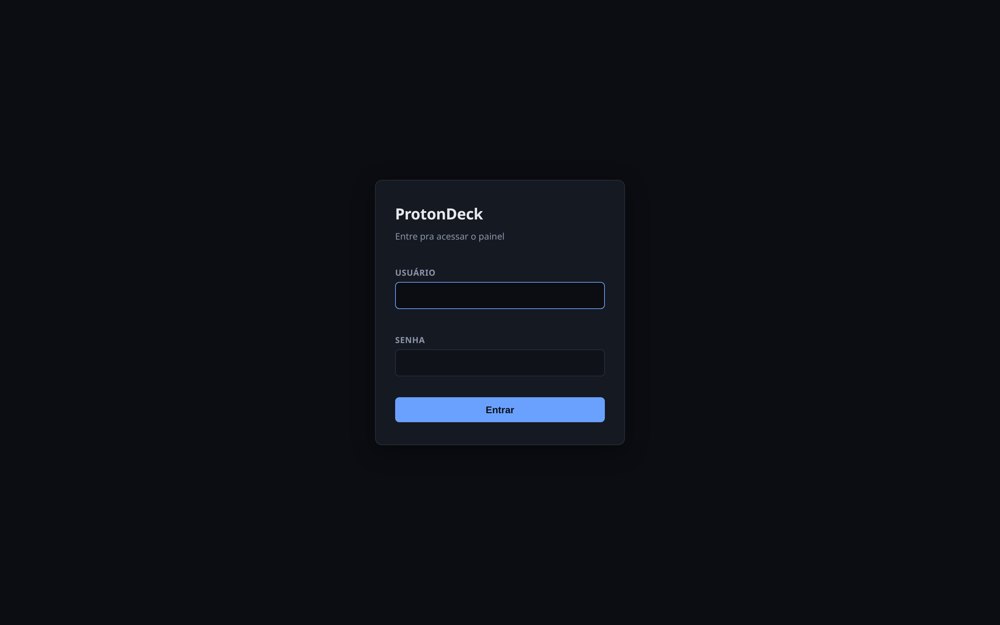
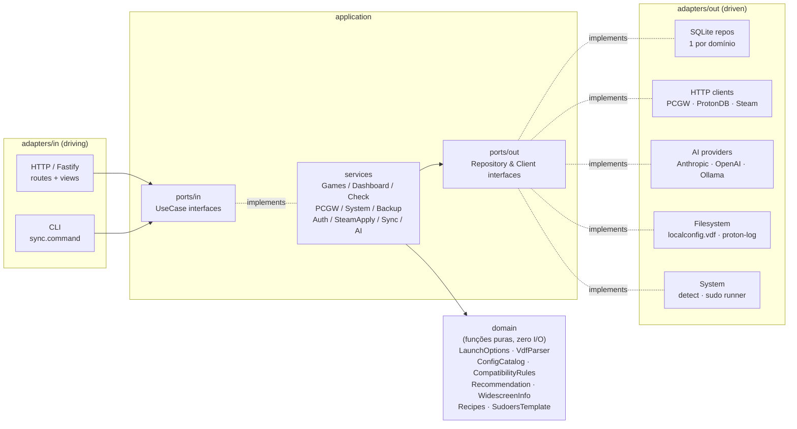
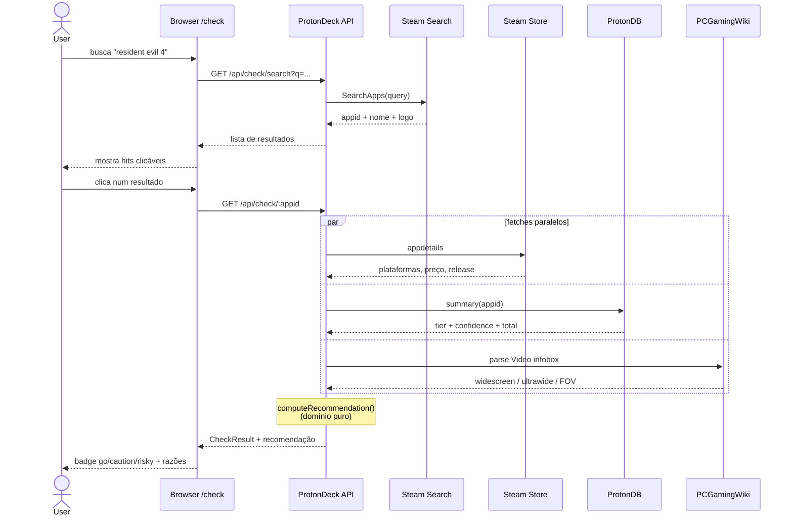
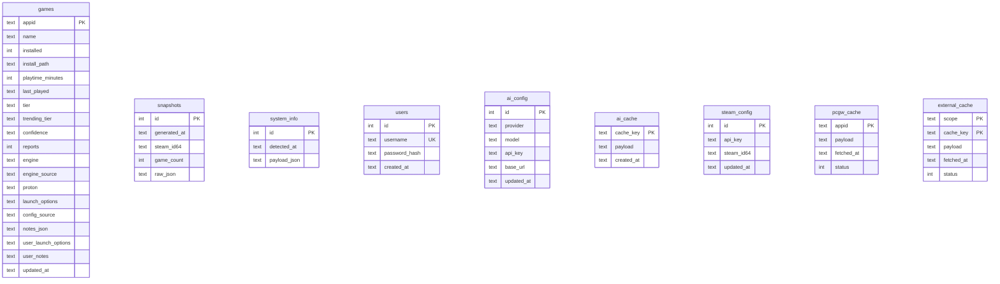

# ProtonDeck

Plataforma self-hosted de curadoria Proton pra Linux gamers. Combina Steam
Web API, ProtonDB, PCGamingWiki e detecção de hardware local
pra te ajudar a configurar jogos com Proton, verificar compatibilidade antes
de comprar, e instalar o stack de gaming na sua distro.

Stack: Fastify 5 + TypeScript + better-sqlite3 + EJS (server-rendered, sem SPA).
Arquitetura hexagonal — domain puro / ports / use cases / adapters separados.

## Screenshots

| Dashboard                                | Builder de launch options (Evil West)  |
|------------------------------------------|----------------------------------------|
|  |  |

| "Vai rodar?" — Resident Evil 4           | Wizard de pacotes                      |
|------------------------------------------|----------------------------------------|
|  |  |

| Biblioteca                               | Backup &amp; Import                    |
|------------------------------------------|----------------------------------------|
|   |  |

| "Vai rodar?" (busca vazia)               | Login                                  |
|------------------------------------------|----------------------------------------|
|  |  |

Pra regenerar os screenshots após mudanças na UI:

```bash
npm run dev &                       # outro terminal
node scripts/screenshots.mjs        # gera docs/screenshots/*.png
```

Script usa Playwright + Chromium headless. Faz login com o user/senha em
`PD_USER` / `PD_PASSWORD` (defaults `admin` / `1354a52a`).

## O que tem

| Area                          | URL          | O que faz                                                                                     |
|-------------------------------|--------------|-----------------------------------------------------------------------------------------------|
| **Dashboard**                 | `/`          | stats da biblioteca, distribuição por tier ProtonDB, atalhos pros principais fluxos. |
| **Biblioteca**                | `/games`     | tabela filtravel da Steam library: tier, engine detectada, Proton version, override pessoal. |
| **Editor de launch options**  | `/game/:appid` | builder visual com checkboxes pra gamescope, env vars (DXVK/VKD3D/Proton/NVIDIA), args, presets por engine, preview ao vivo, diagnostico de conflitos, assistente IA. |
| **PCGamingWiki widescreen**   | (dentro do `/game/:appid`) | suporte a widescreen 16:9 / ultra-widescreen 21:9 / multi-monitor / 4K / FOV, com notas extraidas da wiki. |
| **"Vai rodar?"**              | `/check`     | busca jogo na Steam por nome (mesmo que nao esteja na biblioteca) e cruza ProtonDB + PCGW + Steam Store; retorna recomendacao em 5 niveis (go / caution / risky / unreleased / no-data). [diagrama de fluxo abaixo](#fluxo-vai-rodar-check) |
| **Wizard de pacotes**         | `/system`    | detecta distro (Arch/CachyOS, Ubuntu/Debian, Fedora) + GPU e instala em tempo real via SSE o stack Proton (gamescope, mangohud, gamemode, Vulkan, Steam, protontricks). |
| **Backup &amp; Import**       | `/backup`    | exporta seus overrides em JSON; importa com preview antes de aplicar.                       |
| **Aplicar direto no Steam**   | botao em `/game/:appid` | edita `~/.steam/steam/userdata/&lt;id&gt;/config/localconfig.vdf` com backup automatico e barreira se o cliente Steam estiver rodando. |
| **Auth single-user**          | `/setup` → `/login` | bcrypt + sessão assinada via `@fastify/secure-session`.                    |

## Arquitetura

Hexagonal clássica (ports &amp; adapters de Cockburn) com camadas
**domain / application / adapters**.



```
src/
  domain/                          entidades + funcoes puras (zero I/O)
    games/                         LaunchOptions, ConfigCatalog, CompatibilityRules, VdfParser
    check/                         CheckResult, ProtonReport, Recommendation
    pcgw/                          WidescreenInfo
    system/                        Recipes, SudoersTemplate, SystemTypes

  application/                     a "hexagon" — orquestra o dominio
    ports/
      in/                          inbound (primary/driving) ports — interfaces
                                   dos use cases que o mundo externo chama:
                                   GamesUseCase, DashboardUseCase, CheckUseCase,
                                   PCGWUseCase, SystemUseCase, BackupUseCase,
                                   AuthUseCase, SteamApplyUseCase, SyncUseCase, AIUseCase
      out/                         outbound (secondary/driven) ports —
                                   interfaces que a application REQUER:
                                   GameRepository, UserRepository,
                                   AIConfigRepository, SteamConfigRepository,
                                   CacheRepository, SnapshotRepository,
                                   SystemInfoRepository, PCGWClient,
                                   CheckClients, ProtonDBCommunityClient,
                                   SteamLocalConfigClient, ProtonLogReader,
                                   SystemDetector, SystemRunner
    services/                      implementacoes dos inbound ports
                                   (GamesService implements GamesUseCase, etc)

  adapters/
    in/                            inbound adapters — driving
                                   (chamam os ports/in/)
      http/                        Fastify Server.ts + routes/ + views/ + public/
      cli/                         sync.command.ts
    out/                           outbound adapters — driven
                                   (implementam os ports/out/)
      persistence/sqlite/          connection.ts + 1 repo por dominio
      http-clients/                PCGWMediaWiki, ProtonDB (summary + community),
                                   SteamSearch, SteamStore
      ai/                          AIProvider (Anthropic/OpenAI/Ollama) + Prompts + Tools
      fs/                          SteamLocalConfigFs, ProtonLogFs
      system/                      LinuxSystemDetector, SudoSystemRunner
      shared/                      fetch helper

  composition.ts                   monta o grafo de deps (composition root)
  main.ts                          entry point HTTP
```

Regras de dependência:

- **`domain/`** não importa de ninguém.
- **`application/`** importa só de `domain/` e dos próprios
  `application/ports/`.
- **`adapters/in/`** chama `application/ports/in/` (use cases).
- **`adapters/out/`** implementa `application/ports/out/`.
- **`composition.ts`** é o único arquivo que instancia adapters
  concretos e injeta no grafo.

Trocar SQLite por Postgres mexe só em `adapters/out/persistence/`.
Trocar Anthropic por Bedrock mexe só em `adapters/out/ai/`. Adicionar
uma CLI nova mexe só em `adapters/in/cli/`.

## Setup (desenvolvimento)

```bash
git clone ssh://git@gitea.homelab-cloud.com:2222/admin/protondeck.git
cd protondeck
npm install
cp .env.example .env
echo "SESSION_KEY=$(openssl rand -hex 32)" >> .env

# Popula data/panel.db chamando o skill steam-launch
npm run sync

# Sobe em http://localhost:3030
npm run dev
```

Requisitos:

- Node.js ≥ 20.12 (precisa do `process.loadEnvFile`)
- Skill `steam-launch` instalada em `~/.claude/tools/steam-launch/` (ou path em `STEAM_LAUNCH_TOOL`)
- `credentials.json` em `~/.claude/tools/steam-launch/data/` com `steam_api_key` + `steam_id64`

No primeiro acesso o painel redireciona pra `/setup` pra criar a conta admin.
Single-user — não tem cadastro aberto. Pra resetar:

```bash
sqlite3 data/panel.db "DELETE FROM users;"
```

### Wizard de pacotes — sudoers (uma vez)

Pra evitar prompt de senha a cada install, o painel precisa de um
`/etc/sudoers.d/protondeck` com whitelist restrita (só subcomandos de
install/sync — não permite `-R` nem `-U`). Abra `/system` na UI que
ele gera o comando exato pra sua distro/usuario; rode no terminal:

```bash
sudo tee /etc/sudoers.d/protondeck > /dev/null <<'EOF'
USER ALL=(root) NOPASSWD: /usr/bin/pacman -S --needed --noconfirm *
# ... resto gerado dinamicamente pela tela
EOF
sudo chmod 440 /etc/sudoers.d/protondeck
sudo visudo -c -f /etc/sudoers.d/protondeck
```

### Aplicar direto no Steam — requer cliente fechado

A rota `POST /api/game/:appid/apply-steam` edita o `localconfig.vdf` e faz
backup `.protondeck.bak`. **Se o Steam estiver rodando**, o cliente
sobrescreve o arquivo ao fechar — o painel detecta isso via `pgrep -x steam`
e bloqueia o write com mensagem clara.

## Tarball (recomendado pra uso completo)

Pra rodar com TODAS as features (incluindo wizard de pacotes, sync,
apply Steam, proton log) o painel precisa de acesso ao host — Docker
isola e bloqueia tudo isso. Use o tarball release:

### Gerar o tarball (no repo)

```bash
npm run release
# gera dist-release/protondeck-<version>.tar.gz (~63 MB com Node embarcado)
```

O build **embarca o binário do Node** (mesma versão que rodou
o `npm ci` — garante ABI match com `better-sqlite3`). Tarball fica
totalmente self-contained: zero dependência do Node do sistema do
user-alvo. Custo: ~40 MB a mais (Node ~30 MB compactado).

Pra release "lite" sem embed (~22 MB; depende do Node do user-alvo):

```bash
NO_EMBED_NODE=1 npm run release
```

Por default empacota pra `linux-x64`. Pra outras arquiteturas:

```bash
NODE_ARCH=linux-arm64 npm run release
```

### Instalar (na máquina alvo)

```bash
tar xzf protondeck-0.1.0.tar.gz
cd protondeck-0.1.0
./install.sh
```

O `install.sh`:

- copia tudo pra `~/.local/share/protondeck/` (override via `PROTONDECK_HOME`);
- gera `.env` com `SESSION_KEY` aleatória (64 hex chars);
- cria `~/.config/systemd/user/protondeck.service`;
- preserva `data/` e `.env` em re-execuções (upgrade).

Pra subir:

```bash
systemctl --user enable --now protondeck   # roda agora + ao boot
systemctl --user status protondeck         # ver estado
journalctl --user -u protondeck -f         # logs
```

Pra rodar mesmo após logout (background persistente em servidor sem GUI):

```bash
sudo loginctl enable-linger $USER
```

### Atualizar

```bash
tar xzf protondeck-0.2.0.tar.gz
cd protondeck-0.2.0
./install.sh           # detecta install existente, preserva data/ e .env
systemctl --user restart protondeck
```

### Desinstalar

```bash
~/.local/share/protondeck/uninstall.sh
# pergunta se quer manter ou apagar data/ (panel.db)
```

### Resolução do Node

O `ExecStart` da unit aponta pra `run.sh` — um wrapper que resolve `node`
em ordem de prioridade:

1. **Node embarcado** no release — `$INSTALL_DIR/node` (preferido; release default).
2. **fnm** — symlink `~/.local/share/fnm/aliases/default` (estavel; atualiza
   sozinho quando você troca via `fnm alias default`).
3. **nvm** — `~/.nvm/alias/default` (resolve cadeia `default → lts/iron → vX.Y.Z`).
4. **asdf** — `~/.asdf/shims/node` (shims sao estaveis).
5. **PATH** — fallback pro `node` que estiver no PATH (sistema).

Com Node embarcado (default), o painel funciona em qualquer máquina
Linux x64 sem **nenhuma** dependência. Se você usar release lite
(`NO_EMBED_NODE=1`), o wrapper cai pros gerenciadores de versao acima — e
você pode trocar de versão Node sem reinstalar (só
precisa reinstalar se mudar de **manager**, ex: nvm → fnm).

## Docker

```bash
# 1. Configura env
echo "SESSION_KEY=$(openssl rand -hex 32)" > .env

# 2. Sobe
docker compose up -d
# (primeiro build ~2 min — compila better-sqlite3 nativo)

# 3. Abre http://localhost:3030

# Logs
docker compose logs -f protondeck

# Parar
docker compose down
```

Variaveis de ambiente (alem do `SESSION_KEY` obrigatorio):

| Var                          | Default                       | O que faz                                    |
|------------------------------|-------------------------------|----------------------------------------------|
| `PORT`                       | `3030`                        | porta HTTP                                   |
| `HOST`                       | `0.0.0.0` no container        | bind address                                 |
| `NODE_ENV`                   | `development`                 | em `production` o cookie sai com `Secure`    |
| `PROTONDECK_DB`              | `/app/data/panel.db`          | path do SQLite                               |
| `PROTONDECK_COMMUNITY_CACHE` | `/app/data/community-cache`   | cache dos relatos ProtonDB                   |

Persistência: o `docker-compose.yml` montá `./data` em `/app/data`,
então `panel.db` + caches sobrevivem ao restart.

### Limitações do Docker

A imagem é auto-contida, mas algumas features dependem do **host**:

| Feature                  | Funciona no container? | Por quê                                                             |
|--------------------------|------------------------|---------------------------------------------------------------------------|
| Dashboard / Biblioteca   | sim                    | só le do SQLite local                                              |
| Editor de launch options | sim                    | pura logica + ProtonDB API publica                                        |
| `/check`                 | sim                    | chama APIs publicas (Steam search/store, ProtonDB, PCGW)                  |
| Backup &amp; Import      | sim                    | só le/escreve no SQLite local                                      |
| **Wizard de pacotes**    | **não**         | precisa de `pacman/apt/dnf` + `sudo` + `/etc/os-release` **do host**     |
| **Apply no Steam**       | **parcial**            | precisa montar `~/.steam` como volume + Steam fechado                    |
| **Sync biblioteca**      | **não**         | precisa do skill local `steam-launch` (não vem na imagem)         |

Pra cobrir o caso de uso completo (com wizard + sync), rode direto em
`npm run dev` no host. O Docker é ideal pra expor o painel num
servidor remoto (ex.: VPS) cobrindo as features que não dependem
do host.

## Testes

Cobertura mínima focada em domain (funções puras) e
application services (com fakes in-memory dos outbound ports):

```bash
npm test           # roda todos os *.test.ts em src/
npm run typecheck  # inclui os testes na verificação de tipos
```

Stack: **`node:test`** (built-in do Node 20+) com **`tsx`** como loader.
Zero deps de teste. Fakes em `src/test/fakes/` implementam os outbound
ports, então services são testados sem mexer no SQLite ou em
APIs externas.

Atualmente cobre (94 testes em 14 arquivos):

**Domain (33 testes):**
- **`domain/games/LaunchOptions`** (6) — parser do launch string (env vars, gamescope, args, resolução forced)
- **`domain/games/VdfParser`** (10) — leitura/escrita do `localconfig.vdf` do Steam (com round-trip)
- **`domain/check/Recommendation`** (10) — todos os 5 caminhos de recomendação (go/caution/risky/unreleased/no-data)
- **`domain/system/SudoersTemplate`** (7) — geração por distro + whitelist estrita (nao permite `-R`/`-U`)

**Application services (61 testes):**
- **`GamesService`** (8) — list/get/saveLaunch/clearNotes/etc
- **`AuthService`** (9) — bcrypt + validações de senha/usuário
- **`BackupService`** (7) — export/validate/plan/apply
- **`DashboardService`** (2) — stats consolidadas
- **`CheckService`** (6) — orquestra search + ProtonDB + Store + PCGW, valida 5 recomendações
- **`PCGWService`** (2) — passthrough (delegação + force option)
- **`SystemService`** (7) — scan, groupStatuses (filtro por GPU), sudoersTemplate, buildInstallArgs, runSudoSequence
- **`SteamApplyService`** (9) — describe (configured/available/steamRunning) + apply (jogo inexistente, sem override, sem creds, sucesso, steam rodando)
- **`SyncService`** (5) — applySnapshot (upsert + snapshot record + system_info + enrichDefaults + preserva user fields)
- **`AIService`** (6) — get/setConfig, readProtonLog, validações de pre-condição, cache hit determinístico via SHA-256

## Fluxo "Vai rodar?" (`/check`)



## Workflow

| Quando                              | Rode                                                          |
|-------------------------------------|---------------------------------------------------------------|
| Comprou jogo novo                   | `npm run sync` (ou botão "Sync" na sidebar)            |
| Editou config de um jogo na UI      | Salva no SQLite via form                                      |
| Quer ver overrides persistidos      | `sqlite3 data/panel.db "select appid, name, user_launch_options from games where user_launch_options is not null;"` |
| Pensando em comprar um jogo         | `/check` busca por nome e consolida ProtonDB + PCGW + Store   |
| Trocando de PC                      | `/backup` exporta JSON; importe na maquina nova               |
| Setup inicial em distro nova        | `/system` detecta e instala stack de gaming Proton            |

## Schema do banco

- `games` — uma linha por jogo da biblioteca, com snapshot ProtonDB + launch
  options geradas + colunas `user_launch_options` / `user_notes` que
  sobrevivem aos syncs.
- `snapshots` — historico de cada sync (raw JSON).
- `system_info` — singleton com hardware/monitor detectado no ultimo sync.
- `users` — conta admin (single-user), `password_hash` bcrypt.
- `ai_config` / `ai_cache` — provider e cache de respostas IA.
- `steam_config` — credenciais Steam (`api_key` + `steam_id64`).
- `pcgw_cache` — cache de paginas do PCGamingWiki (7d hits / 1d falhas).
- `external_cache` — cache generico (ProtonDB, Steam Store, Steam Search).

Schema flat — sem foreign keys entre tabelas. `games` agrega tudo que importa
por jogo; o resto e' singleton ou cache:



## Licença

[GNU Affero General Public License v3.0 ou posterior](LICENSE) (AGPL-3.0-or-later).

Resumo prático: você pode usar, modificar e redistribuir o ProtonDeck
livremente, inclusive em servidor próprio. Se você rodar uma versão
modificada acessível pela rede (ex.: hospedar pra outras pessoas), precisa
disponibilizar o código-fonte das suas modificações sob a mesma
licença.
